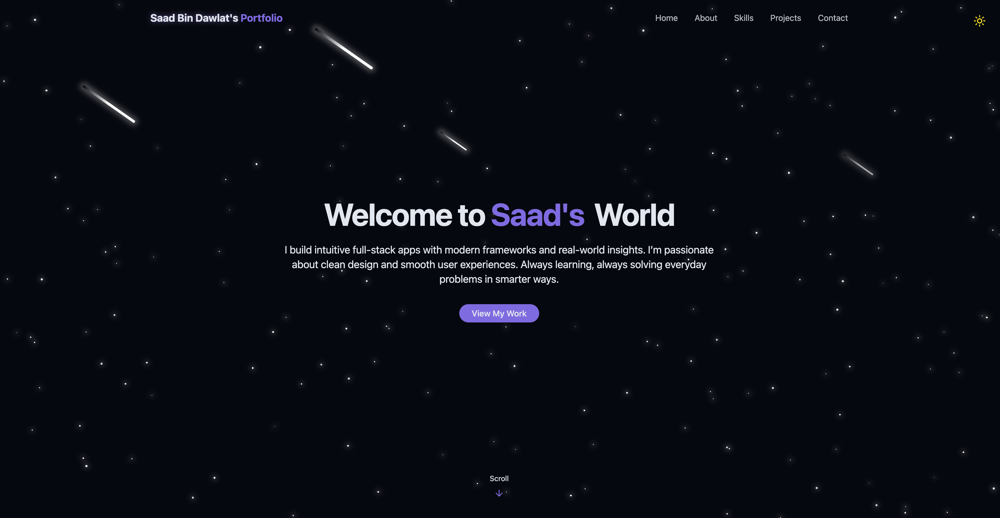

# 🚀 Portfolio Website

A modern developer portfolio built with **React**, **TailwindCSS**, and **Vite** — showcasing projects, skills, certifications, and a contact section with responsive UI and dark mode support.

<div align="center">
  
</div>

---

## 🛠️ Tech Stack

- **React** – Component-based frontend framework  
- **Vite** – Fast development build tool  
- **Tailwind CSS** – Utility-first CSS framework  
- **Lucide Icons** – Icon pack for UI elements  
- **Radix UI** – Accessible components  
- **TypeScript** – (Optional) for static typing  
- **GitHub & Vercel** – Deployment

---

## 💡 Features

- Dark/Light mode toggle  
- Animated backgrounds (stars, meteors)  
- Responsive mobile navigation  
- Hero, About, Projects, Skills, and Contact sections  
- Real GitHub integration for each project  
- Toast notifications for form submission  
- Deployed on Vercel  

---

## 🖥️ Getting Started

```bash
git clone https://github.com/saadbindawlat/Portfolio-Website.git
cd Portfolio-Website
npm install
npm run dev
